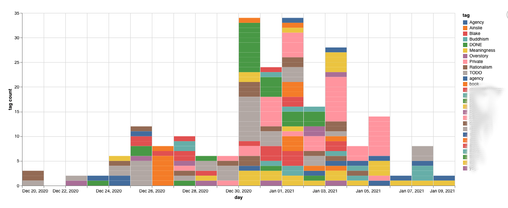

# roam-timeline

Generate timelines from [Roam](https://roamresearch.com) graphs. 

Different graphs are possible; currently the default is a stacked bar chart, each bar is a day, stacks are counts of common tags.

Status: crude but working. Here's an example from my first two weeks of using Roam

## Usage

Export a graph from Roam in JSON  format, then do:

    $ lein run <zipfile>

Graph will pop up in your default web browser. 

If you omit the zipfile argument, it will default to using the latest Roam export in `~/Downloads`.

Example:

### TODO s

### Options
- Limit to n tags or tags with > m usages (currently fixed at 3)
- Limit to Daily Notes
- Filter to time range (currently uses latest year)

### Legend
- order by count

### Service
- Deploy as a web service

## License

Copyright © 2021 Michael Travers, Hyperphor

This program and the accompanying materials are made available under the
terms of the Eclipse Public License 2.0 which is available at
http://www.eclipse.org/legal/epl-2.0.

This Source Code may also be made available under the following Secondary
Licenses when the conditions for such availability set forth in the Eclipse
Public License, v. 2.0 are satisfied: GNU General Public License as published by
the Free Software Foundation, either version 2 of the License, or (at your
option) any later version, with the GNU Classpath Exception which is available
at https://www.gnu.org/software/classpath/license.html.
